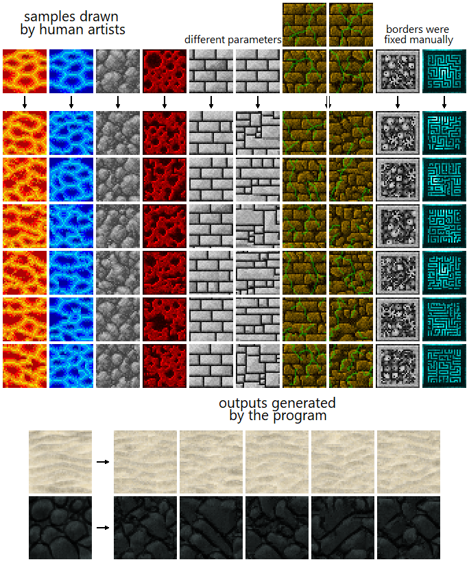
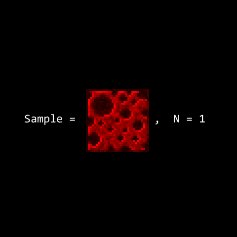
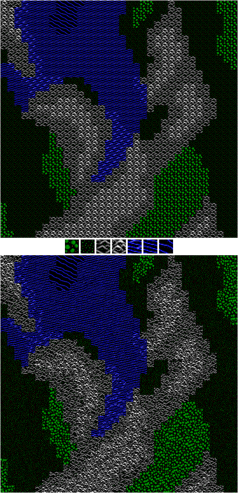
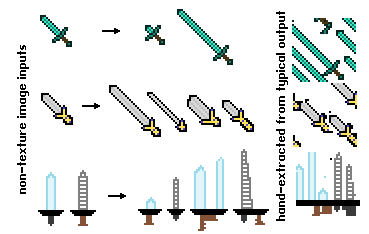

The algorithms are:

1. Full neighbourhood search algorithm of [Scott Draves](http://draves.org/fuse) and [Alexei Efros + Thomas Leung](https://www.eecs.berkeley.edu/Research/Projects/CS/vision/papers/efros-iccv99.pdf) and [Li-Yi Wei + Marc Levoy](https://graphics.stanford.edu/papers/texture-synthesis-sig00/texture.pdf) is probably the simplest texture synthesis algorithm imaginable.
2. K-coherent neighbourhood search of [Michael Ashikhmin](http://www.cs.princeton.edu/courses/archive/fall10/cos526/papers/ashikhmin01a.pdf) and [Xin Tong + Jingdan Zhangz + Ligang Liu + Xi Wangz + Baining Guo + Heung-Yeung Shum](http://research.microsoft.com/pubs/65191/btfsynthesis.pdf)  takes computational burden from the synthesis to the analysis part and therefore is better suited for synthesizing large textures.
3. Resynthesis algorithm of [P. F. Harrison](http://logarithmic.net/pfh-files/thesis/dissertation.pdf) is  scale-invariant, fast, supports constraints and practically never produces completely unsatisfactory results.

Note that my implementations are not completely true to the original papers.

Watch a video demonstration of P. F. Harrison's algorithm on YouTube: [https://www.youtube.com/watch?v=8sUMBMpZNzk](https://www.youtube.com/watch?v=8sUMBMpZNzk).

Guilherme Rossato wrote [build instructions for Windows](https://github.com/mxgmn/SynTex/pull/3/files).
